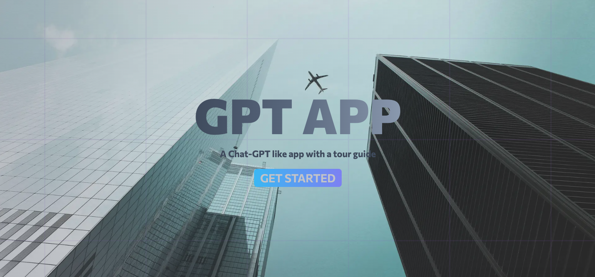
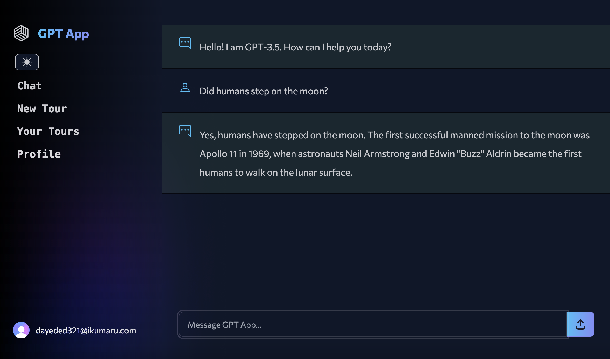
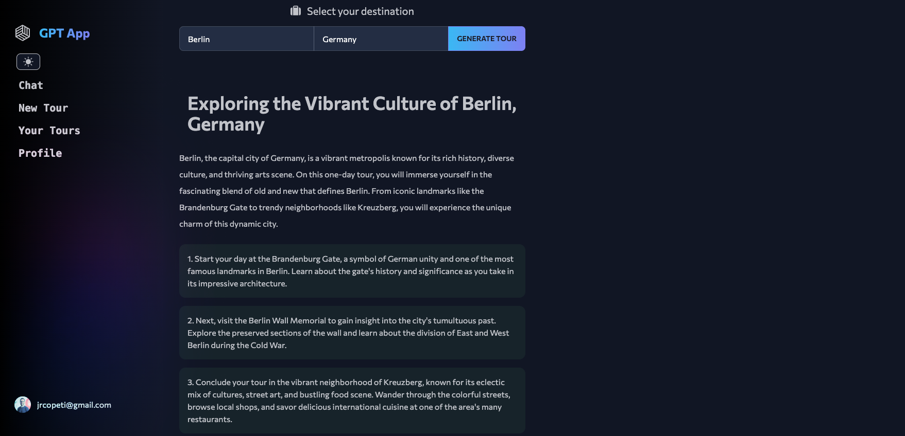
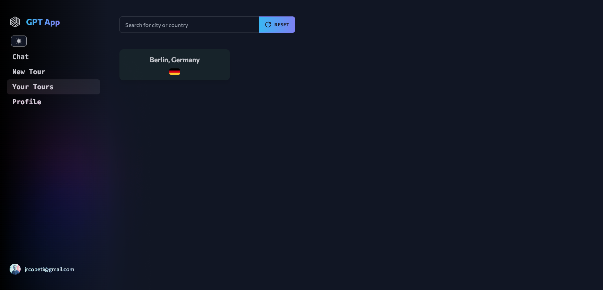
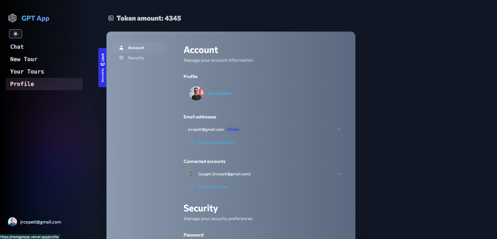
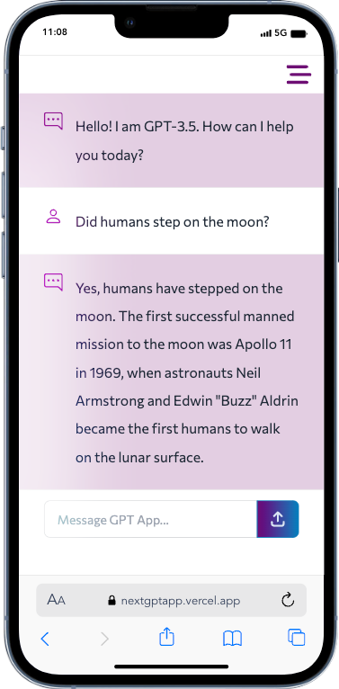
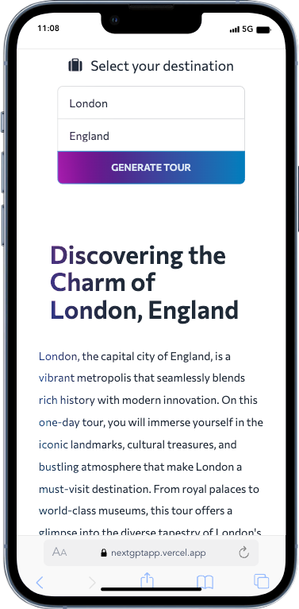
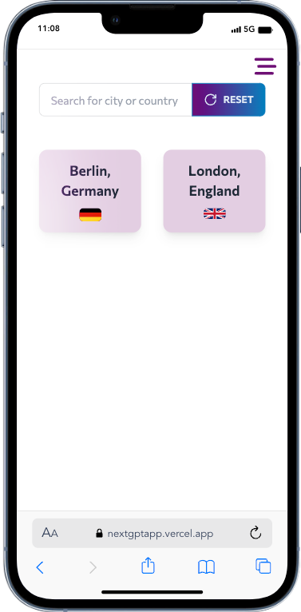
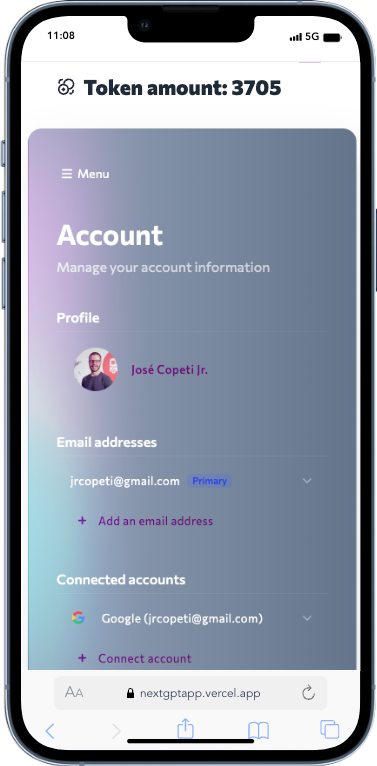

# GPT APP

https://nextgptapp.vercel.app/

## Overview
Welcome to the GPT App!
This is an full-stack web application, built with Next.js and TypeScript, that uses Open AI API to generate text based on user input, just like chat GPT. On top of that, it also provides a city guide tour. Just write a city and country, and it will guide you through the best places to visit, things to do, and experiences to enjoy. This is an early development of Trip-AI application.

## Features
- **Dynamic Text Generation**: Utilizing GPT-3.5 turbo, the app generates text based on user input.
- **City Tours**:  Simply enter a city and country, and let the app create tour guide for you. The tours will be saved in your account for future reference.
- **User Tokens**: Users have a an amount of tokens to use the app. Each time a user generates a tour, a token is used.
- **Responsive Design**: The app is designed to work seamlessly on all devices, from desktops to smartphones.

## Technologies Used

- TypeScript
- Next.js
- PostgreSQL as database
- Prisma to interact with the database
- OpenAI API
- TanStack Query for syncing server data with the client state
- Tailwind CSS and Daisy UI for styling
- Clerk as authentication provider
- Vercel for deployment

## Desktop view - Dark mode

## Mobile view - Light mode

